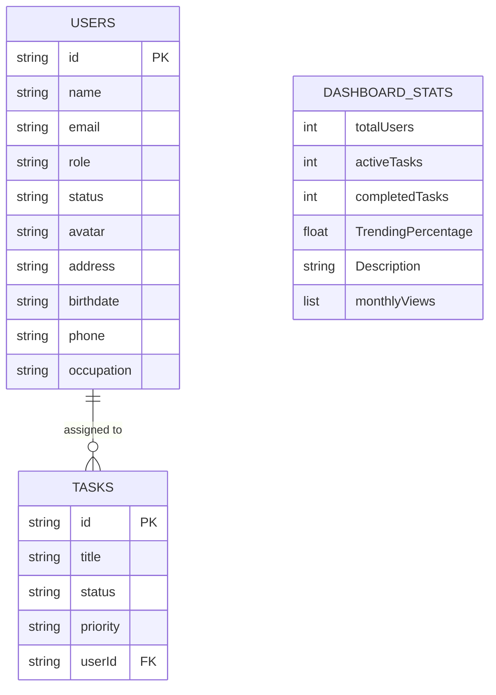

# NestJS Tasks API

## 📖 Overview

A simple **NestJS** REST API for managing tasks. It demonstrates a clean architecture with:

- **DTO validation** using `class-validator`
- **TypeORM** integration (PostgreSQL)
- **Full CRUD** endpoints (`GET`, `POST`, `PATCH`, `PUT`, `DELETE`)
- **Global API prefix** (`/api`)

## 🛠️ Prerequisites

| Tool              | Version |
| ----------------- | ------- |
| Node              | >= 20   |
| npm               | >= 10   |
| PostgreSQL        | >= 15   |
| Docker (optional) | >= 20   |

## 📦 Installation

```bash
# Clone the repo
git clone <repo-url>
cd nestjs-tasks

# Install dependencies
npm ci
```

## 🔧 Environment variables

Create a `.env` file at the project root (copy from `.env.example` if present):

```dotenv
POSTGRES_HOST=localhost
POSTGRES_PORT=5432
POSTGRES_USER=postgres
POSTGRES_PASSWORD=postgres
POSTGRES_DATABASE=nestjs_tasks
PORT=3001
```

## 🗄️ Database

The project uses **TypeORM**. During development we keep `synchronize: true` for rapid schema changes, but **never** enable this in production.

```ts
// src/app.module.ts
TypeOrmModule.forRoot({
  // ...
  synchronize: true, // dev only
});
```

When deploying, switch to migrations:

```bash
# generate a migration (after changing entities)
npm run migration:generate -- src/migrations/Init
# run migrations
npm run migration:run
```

## ▶️ Running the application

### Development

```bash
npm run start:dev   # watches files and restarts automatically
```

The API will be available at **http://localhost:3001/api**.

### Production (Docker example)

```dockerfile
# Dockerfile (place in project root)
FROM node:20-alpine AS builder
WORKDIR /app
COPY package*.json ./
RUN npm ci
COPY . .
RUN npm run build

FROM node:20-alpine AS runtime
WORKDIR /app
COPY --from=builder /app/dist ./dist
COPY package*.json ./
RUN npm ci --only=production
EXPOSE 3001
CMD ["node", "dist/main.js"]
```

Build & run:

```bash
docker build -t nestjs-tasks .
docker run -p 3001:3001 --env-file .env nestjs-tasks
```

## 📊 Database Schema & Relationships

The project uses a JSON-based database (`db.json`) managed by `json-server`. The data model consists of three main entities with a one-to-many relationship between users and tasks.



### Relationships

- **One-to-Many (Users to Tasks)**: A single user can be assigned multiple tasks, linked by the `userId` field in the `tasks` entity.
- **Dashboard Statistics**: The `dashboardStats-monthlyViews` object provides pre-aggregated data for the analytics dashboard, including a breakdown of traffic over the last 6 months.

## 📋 API Endpoints

| Method     | Path            | Description                   | Request body              | Response           |
| ---------- | --------------- | ----------------------------- | ------------------------- | ------------------ |
| **POST**   | `/api/task`     | Create a new task             | `CreateTaskDto`           | `ResponeTaskDto`   |
| **GET**    | `/api/task`     | Get all tasks                 | –                         | `ResponeTaskDto[]` |
| **GET**    | `/api/task/:id` | Get a task by ID              | –                         | `ResponeTaskDto`   |
| **PATCH**  | `/api/task/:id` | Partially update a task       | `UpdateTaskDto` (partial) | `UpdateResult`     |
| **PUT**    | `/api/task/:id` | Replace a task (full payload) | `CreateTaskDto` (full)    | `UpdateResult`     |
| **DELETE** | `/api/task/:id` | Delete a task                 | –                         | `DeleteResult`     |

### Example `curl` commands

```bash
# Create
curl -X POST http://localhost:3001/api/task \
  -H "Content-Type: application/json" \
  -d '{"title":"Buy milk","status":"pending","priority":"high","userId":1}'

# Get all
curl http://localhost:3001/api/task

# Update (PATCH)
curl -X PATCH http://localhost:3001/api/task/1 \
  -H "Content-Type: application/json" \
  -d '{"status":"completed"}'

# Replace (PUT)
curl -X PUT http://localhost:3001/api/task/1 \
  -H "Content-Type: application/json" \
  -d '{"title":"Buy bread","status":"pending","priority":"medium","userId":1}'

# Delete
curl -X DELETE http://localhost:3001/api/task/1
```

## ✅ Testing

```bash
npm run test          # unit tests
npm run test:cov      # with coverage report
```

---

_Feel free to modify the README layout, add badges or a live demo link to match your project's branding._
